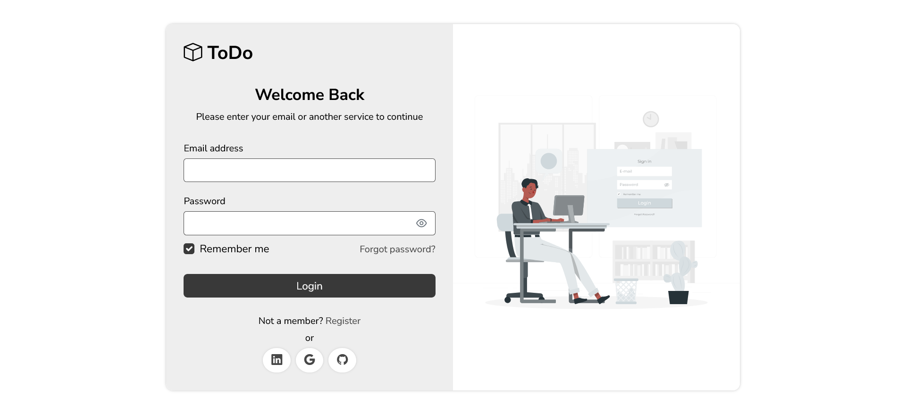
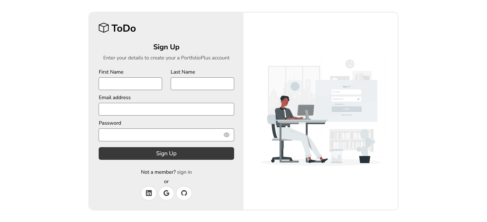
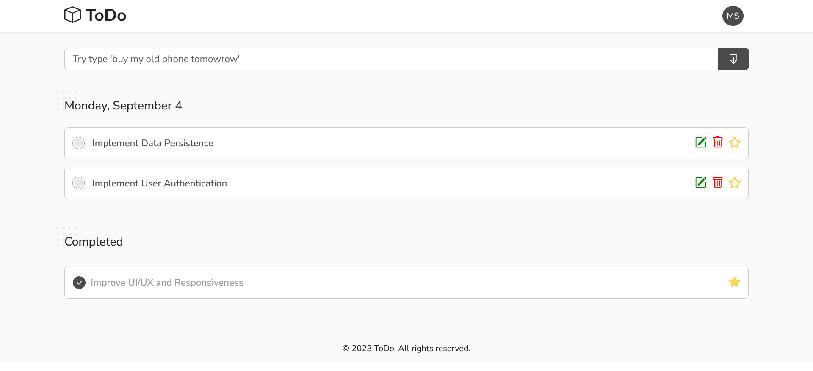
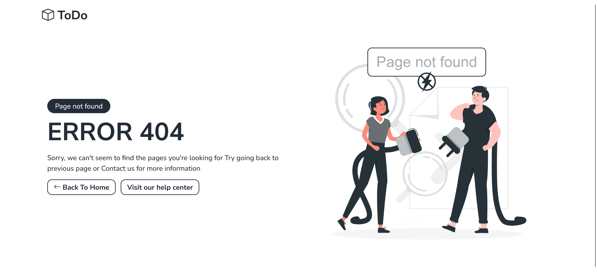

# Todo
#### ToDo a user-friendly and efficient online to-do list website that helps you stay organized and productive. 
### Login Page 

### Sign up Page 

### Home Page 

### Error Page 

### Project structure
<pre>
|-- app
|   |-- shared
|   |   |-- components
|   |   |   |-- cdk-drag-drop-connected-sorting-example
|   |   |   |-- page-not-found
|   |   |   |-- layout
|   |   |   |   |-- footer
|   |   |   |   |-- header
|   |   |-- module
|   |   |   |-- todo
|   |   |-- service
|   |   |   |-- todo-service
|   |   |   |-- auth-service
|   |   |-- directives
|   |   |-- pipes
|   |   |   |-- custom-date-pipe
|   |   |-- core
|   |   |   |-- guards
|   |   |   |   |-- auth-guard
|   |   |   |-- interceptors
|   |   `-- shared.module.ts
|   |-- modules
|   |   |-- home
|   |   |   |-- components
|   |   |   |-- home-routing.module.ts
|   |   |   `-- home.module.ts
|   |   |-- auth
|   |   |   |-- login
|   |   |   |-- signup
|   |   |   `-- auth.module.ts
|   `-- app.component.ts
|   `-- app.module.ts
|   `-- app-routing.module.ts
|-- assets
|   |-- images
|   `-- config.json
|-- environments
|   |-- environment.prod.ts
|   `-- environment.ts
|-- index.html
|-- main.ts
|-- styles.scss
|-- package.json
|-- tsconfig.json
|-- tslint.json
|-- angular.json
|-- karma.config.js
`-- README.md
</pre>
